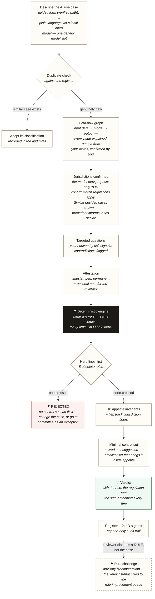
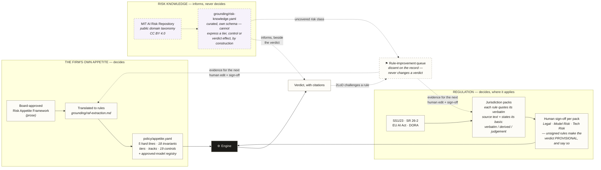

# AIGate

**AI risk appetite as code, for banks.**

A bank's board approves a Risk Appetite Framework as prose. AIGate turns it into executable rules — and turns AI use-case approval from a months-long, multi-hundred-question committee process into a deterministic pre-check that returns a verdict in minutes: **approved / approved with these controls / rejected**, with the exact regulatory reasoning on record.

> **New here? The 90-second version.** Someone in a bank wants to build or
> buy an AI tool. Today, finding out whether that's allowed takes weeks of
> committee email. AIGate answers it in minutes: describe the use case,
> confirm what the tool understood, and get a verdict computed by fixed,
> citable rules — **no AI makes the decision**, ever. It's built and run by
> a practitioner who does this review work for a living, as a working
> proof that a risk appetite can be executable instead of a PDF.
> **Fastest way in:** open the [live demo](https://oza977-max.github.io/ai-raf-precheck/),
> click **About** for the plain-words tour, then **Register** to read a few
> decided cases — no setup, nothing to install.

## Two ways to describe a use case

You choose one, every time you start a pre-check:

- **Guided form** — short, structured questions. No AI involved. This is the most-verified path.
- **Plain language** — write a sentence or two about what the AI does; an optional local model reads it into the same structured graph for you to check and correct on the next screen. Nothing it proposes is used until a person confirms it — see [How regulatory grounding works — and its limits](#how-regulatory-grounding-works--and-its-limits) for what that model does and doesn't get right.

Either way, AIGate maps the use case to a data-flow graph, evaluates it against the firm's machine-readable appetite plus jurisdiction packs (SS1/23, EU AI Act, SR 26-2, DORA), and returns:

- a **verdict with its "why"** — which rule set the **tier** (how much harm the case could do), which appetite rule (**"invariant"**) it tripped, each with its regulatory citation;
- the **minimal control set** that brings the use case inside appetite (solved, not suggested), each control carrying a VERIFIED/UNVERIFIED evidence status;
- a **regulatory reasoning chain** quoting the verbatim source text, the basis of the rule drawn from it, and the human sign-off behind every jurisdictional rule that fired;
- **standing conditions** — the operating bounds the approval assumes (the verdict is a hypothesis; drift outside the bounds voids it);
- an entry in a **graph-based AI register** with a second-line-of-defence (**"2LoD"**) approval workflow and an append-only audit trail of every event.

Same inputs, same verdict, every time — no LLM in the decision path.

## What AIGate is not

- **It does not tell you a use case is "compliant".** The output is "inside your stated appetite, with these controls" — a claim a firm can actually defend. "Compliant" is not something a tool can compute from a config file, and one that claims to is a liability.
- It does not write your risk appetite. It enforces the one you give it.
- It does not replace InfoSec, vendor risk, or legal review — it triggers those as named downstream steps.
- It does not monitor deployed systems (V2) or catch systems that bypass intake.

## One case, end to end

Every use case becomes the same three-part picture — **what data goes in → what model processes it → what the output does** — and the rules judge that picture, not your prose.

*"A chatbot that answers wealth clients' product and portfolio questions in natural language, with a human adviser escalation route."*

```
business product info ──▶  LLM on a cloud vendor  ──▶  answers shown to clients
   (nothing sensitive,       (a person reviews           (recommends, doesn't
    vendor-hosted)            its answers)                decide; reversible)
```

The engine walks that graph: no hard line crossed; client-facing generative output trips the disclosure and reliability rules; the smallest fix is a named control set (tell clients it's AI, ground the answers, keep the human escalation route). Verdict: **in appetite with those controls, tier High** — and because a UK jurisdiction rule fired that nobody at the firm has signed off yet, the verdict is stamped **provisional and says so**. This exact case ships as one of the six in-app samples, scored by the real engine.

## Why it's different

- **Deterministic, not generative.** Same inputs, same verdict, byte for byte — asserted by test. No LLM in the decision path; the optional model only reads descriptions in and explains verdicts out.
- **It refuses to fabricate.** Unsigned rules make the verdict PROVISIONAL and say so; controls without evidence render UNVERIFIED; genuine legal ambiguity is routed to humans, not papered over.
- **Everything is traceable.** Verdict → rule → verbatim regulatory text → the named human who signed it, on an append-only audit trail.
- **Decisions accumulate.** Every verdict lands in a register the next pre-check consults — duplicate detection and similar-decided-cases turn the register into precedent, while the rules, not the precedent, decide.

## What's the tool, and what's yours

Three layers, and knowing which is which unlocks the whole product:

| Layer | What it is | Who owns it |
|---|---|---|
| **The tool** — engine, screens, register, audit trail | Fixed machinery: walks the use-case graph, applies whatever rules are loaded, records everything. Contains **no opinions about risk**. | The product |
| **Your appetite** — `policy/appetite.yaml` | The firm's own positions: hard lines, invariants, controls, tiers. **Does ~90% of the work.** Plain commented YAML a risk manager can read. | **Your firm** |
| **Jurisdiction packs** — `policy/packs/*.yaml` | Regulator-derived overrides, each rule quoting its verbatim source text with a named human sign-off. They only ever *modify* what your appetite decided. | Your Legal / Model Risk / Tech Risk |

The tool with no policy is a calculator with no formula. The starter policy
in the box is a complete working formula — yours the moment someone at your
firm adopts it. **[docs/policy-to-yaml.md](docs/policy-to-yaml.md)** is the
step-by-step guide for turning your own appetite prose into the YAML.

## Why this exists

Every bank now has an AI governance process, and almost every one of them is
the same thing: a long questionnaire, a committee, and a wait measured in
months. The bottleneck isn't diligence — it's that the firm's risk appetite
lives as prose, so every use case has to be *interpreted* against it by
scarce second-line people, one meeting at a time. Interpretation doesn't
scale. Rules do.

AIGate is a working test of one idea: **if the appetite were code, the first
pass of that process would take minutes, not months** — and the answer would
be the same for everyone, for stated reasons, on the record. It was built by
a risk practitioner, on personal time with public sources, to find out
whether the idea survives contact with realistic use cases.

It is deliberately the *opposite* of adding AI to governance. The verdict is
computed by deterministic rules; the honest boundary of what a tool may
claim is enforced on every screen; and where a human must stand behind a
judgement — every regulatory interpretation, every sign-off — the tool
records the human, or says plainly that one is missing.

## What happens to a use case



## The three levers

**Appetite decides. Law decides, where it applies. Knowledge only
challenges.** Every rule the engine applies traces to exactly one of three
sources, and the verdict shows which — with the verbatim text and the
human sign-off behind it. Only the first two can move a verdict; the third
cannot, by construction of its own schema, not by convention:



Both rule files are plain, commented YAML a risk manager can read and edit —
[see every rule rendered](docs/rules.md), regenerated from the policy files
by `npm run docs:rules`. The knowledge file is a separate, human-curated
snapshot against the [MIT AI Risk Repository](https://airisk.mit.edu/)'s
public domain taxonomy (Slattery et al., MIT FutureTech; CC BY 4.0;
1,700+ risks from 65 frameworks) — see
[docs/approach.md §2a](docs/approach.md#2a-the-third-lever--knowledge-and-its-honest-boundary)
for the honest boundary on what "curated, not synced" actually means.

## What works today (V1 proof-of-concept)

The full gate, end to end: intake (LLM or form) → duplicate check against the register → graph review with corrections → targeted questions with contradiction detection → attestation → deterministic verdict → register with lifecycle governance (Low self-serves; Medium/High/Critical await 2LoD sign-off) → policy editing with automatic re-evaluation queuing → JSON export. AIGate submits itself through its own gate on first launch.

Since v0.4.0 the gate also has its first **feedback path**: a 2LoD reviewer who believes a *rule* is wrong (not the case in front of them) files a **rule challenge** from the sign-off page — permanent, attributable, and advisory by construction: the verdict stands, and the challenge lands in a per-rule **rule-improvement queue** for the humans who author the rulebook. Dissent never overrides; it accumulates as evidence.

**Honest limits, stated in the UI itself**: verdicts are provisional until the firm's CRO adopts the framework and signs the pack rules; the audit trail is client-side (proof-of-concept grade — the system-of-record store is V1.5); artifact binding (reading deployment configs instead of trusting descriptions) and live post-approval monitoring are V1.5/V2.

## Try it (no install)

**Live now:** <https://oza977-max.github.io/ai-raf-precheck/> — open it, then
**Demo data → Load sample use cases**, and open any verdict. Six worked
examples span Low→Critical, in and out of appetite, all scored by the real
engine. The page makes **no external requests at all** — fonts are served
from the app itself, so there is nothing for a corporate network to block.

**Handing this to someone to test?** Send them
[`docs/tester-guide.md`](docs/tester-guide.md) — what to try, what to
ignore, and the known gaps — and ask them to fill in
[`backtest/capture-template.md`](backtest/capture-template.md).

**Run it locally** (Node 22+):

```
npm install
npm run dev          # app on http://localhost:5173
npm test             # full suite
npm run docs:rules   # regenerate docs/rules.md from the policy files
```

No backend, no database, no API key. The whole app is a static build
(`npm run build` → `dist/`), so it can be hosted anywhere; the built page
must be *served*, not opened from the filesystem. `npm run publish-site`
republishes the live site.

**Transparency note — where the AI model fits:** the plain-language intake
path runs on a **local open model** (one generic model slot; Ollama, no
key, no cloud — the description never leaves the machine, and the app
refuses non-local addresses so that promise is enforced, not assumed). It
drafts usable graphs and misreads some fields — which the provenance
quotes, guessed-field questions and per-field review exist to catch.
**Frontier models draft noticeably better**; a firm deployment points the
same slot at a stronger model inside its own boundary. The guided form is
the most-verified path, and the model is optional either way — nothing in
the decision path uses it.

---

**New here?** [`docs/approach.md`](docs/approach.md) explains the thinking —
what question this actually answers, why a 200-page regulation yields two
rules, how pack sign-off works in practice and what it costs, and what the
approach honestly cannot do.

## Adopt it — the rules are yours to own

AIGate works by checking AI use cases against a **Risk Appetite Framework (RAF)** — a set of rules that defines what AI risk the bank will and won't accept. Every verdict, every control requirement, every jurisdiction override traces back to a rule in that framework.

**This means AIGate is only as good as the rules you give it** — though it is
never rule-less: a complete starter ruleset works out of the box, and what
adoption adds is *authority*, not function. Same rules, same verdicts; the
provisional stamp is the only thing a CRO's signature removes.

### If your bank has a formal AI Risk Appetite Framework

You are in the best position. You translate your existing RAF into AIGate's policy file format (YAML). The engine enforces your rules consistently. Verdicts are traceable to your own documented policy.

### If your bank has some AI governance, but it's scattered

Most banks are here — a model risk policy, an AI ethics statement, some vendor guidelines, nothing unified. AIGate ships with a starter policy file derived from a regulator-grounded AI Risk Appetite template. Use it as your starting point. Customise it to reflect your actual committees, thresholds, and appetite. You are not starting from nothing.

### If your bank has no AI-specific governance yet

The starter config effectively becomes your AI risk appetite framework. It is grounded in SR 26-2 (US), SS1/23 (UK PRA), EU AI Act and DORA. Canada, Singapore and Japan are declared operating jurisdictions with no assessed pack — the starter packs for those were deleted in policy v1.3 because their rule text was illustrative and their sources were never retrieved, and a rule citing a source nobody read is worse than no rule. It is a credible, defensible starting point — but it is not your framework until your CRO or equivalent has reviewed and adopted it.

**The starter config is a template. You own what you adopt.**

Using the starter config verbatim without review is an implicit governance decision. Document that decision. The starter config includes placeholder markers (`[FIRM]`) for content your organisation must fill in — committees, thresholds, legal entity references. A verdict produced before those are filled is provisional, not final.

---

## How regulatory grounding works — and its limits

AIGate evaluates use cases against **regulatory override packs** — structured rule files for SR 26-2, SS1/23, EU AI Act and DORA. These drive jurisdiction-aware verdicts: a use case touching UK entities is evaluated against SS1/23's technology-agnostic MRM standard; one touching EU borrowers with credit-scoring characteristics triggers EU AI Act Annex III's forced-Critical classification.

**Regulations evolve. This is the hardest problem in the product.**

Positions move: the US recently carved generative and agentic AI out of its model definition; the EU delayed some obligations while others became live law. A product that encodes a snapshot of today's regulations and never updates is not a governance tool — it is a liability. (The current per-pack states and dates live in [`docs/approach.md`](docs/approach.md), where they are maintained.)

### How AIGate approaches this

**Every rule cites its primary source — the verbatim regulatory text it derives from.**

Not: *"Track II if quantitative output into a regulated decision"*

But: *"Track II — from SS1/23 §3.4: 'models that produce quantitative outputs used in material decisions require independent validation.' Basis: states the quoted text."*

This means:
- The verdict shows you the exact regulatory text behind every decision. You can verify it yourself against the source.
- When a regulation changes, only the rules citing the changed sections need review — not the whole pack.
- Every rule declares its **basis** — whether it restates the quoted text, infers from it, or rests on legal judgement. That is something a reviewer can check by reading the rule against its own citation, rather than a confidence score somebody had to invent.

**Every pack requires a human reviewer sign-off** — name, role, date — against the primary source text. Sign-off is per regulation, not per rule: Legal issues a position on SS1/23, they do not countersign each line of a config file. (A single rule can carry its own sign-off where a firm deviates from the central reading.) AIGate does not interpret regulations autonomously. A bank that tells the PRA "our AI interpreted SS1/23" does not have a defensible answer. A qualified person must stand behind every regulatory determination. AIGate makes that accountability traceable and minimal in effort: reviewers sign off only on rules citing changed text, not the whole pack every time.

**Verdicts show the full reasoning chain:** regulatory text → derived rule → verdict, with the basis of each step stated. A regulator asking "why was this Track II?" sees the SS1/23 section, the rule, and who reviewed it — not just a version number.

**When a bank disagrees with the central interpretation**, they can override locally — but they must cite the competing text and record their reasoning. Silent overrides are not permitted.

**What this does not solve:** genuine legal ambiguity. When regulatory text is contested, AIGate marks the rule `judgement`, renders the verdict provisional, and routes to the bank's legal team. It does not pretend to resolve what qualified lawyers disagree about. That is the honest boundary of what a tool can do.

---

## Getting started, in order

1. **Try the live site** — load the samples, open two or three verdicts.
2. **Back-test your own committee's past decisions** — before touching any
   configuration, run cases your firm has *already decided* through the
   gate and compare its verdicts with what your committee actually ruled.
   [`backtest/use-cases.md`](backtest/use-cases.md) has eight worked
   scenarios with paste-in descriptions and expected outcomes to show the
   method. Where the tool disagrees with your committee, *that
   disagreement is the finding* — it's either a wrong rule to fix or an
   inconsistency worth knowing about. This is the fastest honest test of
   whether appetite-as-code works for your firm, and it costs nothing but
   an afternoon.
3. Open `policy/appetite.yaml` — read the preamble, understand the starter rules.
4. Replace `[FIRM]` placeholders with your organisation's details.
5. Review the materiality tiers and adjust thresholds to your actual appetite.
6. Submit your own new use cases through the gate.

**Making it a habit, not a demo:** the pre-check only compounds if people
come back. Two zero-build triggers that work today — bookmark the live
site's **New pre-check** page in the team's AI/tooling request template
("attach your AIGate verdict id to the ticket"), or add a checklist line to
your PR/change template ("AI in this change? Link the pre-check verdict").
The register then becomes the firm's memory of every AI decision without
anyone maintaining a separate log.

**Explaining it to a regulator or a general audience?**
[`docs/regulator-brief.md`](docs/regulator-brief.md) answers the five
questions a supervisory reader asks — is an AI deciding, who is accountable,
can a decision be evidenced, how does the encoding stay honest, what happens
when the tool doesn't know. [`docs/glossary.md`](docs/glossary.md) is every
term in plain words. The app itself now has an **About** screen answering the
first-timer's three questions, and points at the fastest explainer it has:
AIGate's own self-assessment, sitting in the register.

**Want to poke at it?** [`docs/try-these.md`](docs/try-these.md) — eleven cases
that each make the engine do something different: a clean approval, four
hard-line rejections, platform inheritance working and failing, a jurisdiction
changing the answer, and both ways a verdict can be provisional. Every printed
outcome is pinned by a test, so the page cannot drift from the product.

**Using it for real?** [`docs/user-guide.md`](docs/user-guide.md) is the
task-oriented guide for a risk reader — how to read a verdict, what each
honesty marker means, how to run a sign-off, and what the tool will not tell
you.

---

## What's next

**V1 judges what you attest. What comes next checks it, then watches it.**

Look closely at any verdict and you'll see the next two versions already
wired into it:

- Every verdict carries **standing conditions** with green/amber/red
  thresholds — drift, override rates, incident counts. Today they're checked
  at re-review. **V2 watches them live**: a verdict stops being a document
  and becomes a standing hypothesis that expires itself the moment the
  system drifts outside what was approved. The `amber` and `breached` states
  already exist in every verdict record, waiting.
- Every control renders **evidence: outstanding** until someone attests it.
  **V1.5 reads the evidence itself** — deployment configs, access policies,
  model registries — so "the control exists" becomes something checked, not
  claimed. The same machinery turns attestation around: instead of trusting
  your description of the system, it reads the infrastructure and shows you
  the difference.
- Sign-off is a typed name today. **V1.5 makes it an identity**, with
  segregation of duties — the record that currently *discloses* a
  self-approved case will *prevent* one.

The order is deliberate: first judge honestly (V1), then verify what you
were told (V1.5), then monitor what you approved (V2). Each stage keeps the
rule this whole product is built on — never claim more than you can prove.

## Licence

All rights reserved — published for reading and evaluation, not for
redistribution or commercial use. See [LICENSE](LICENSE), which also
explains how to open it up later if that becomes the right call.

---

## Project status

**V1 build complete, verified Demo-ready.** Engine, intake, register,
lifecycle, jurisdiction packs, audit trail, model governance and the
risk-knowledge lens — 597 tests at v0.13.0, and the full acceptance suite
of 158 cases walked with evidence in
[`test/test-004.html`](test/test-004.html).

*Demo-ready* rather than *ship-ready* is the honest verdict, and the reason is
worth stating plainly: 76 of those 158 acceptance criteria do not carry a
trace ID, so a reader cannot get from a criterion to the test that proves it
without knowing the codebase. Coverage exists; the audit path does not. For a
product that sells auditability, that is the right thing to be held to, and it
is the first thing V1.5 closes.

V1 is an engine-validation proof-of-concept — see **What's next** for the
V1.5/V2 ladder. Built with the
[Grounded Vibe Methodology](https://github.com/gerquinn1978/gvm).
