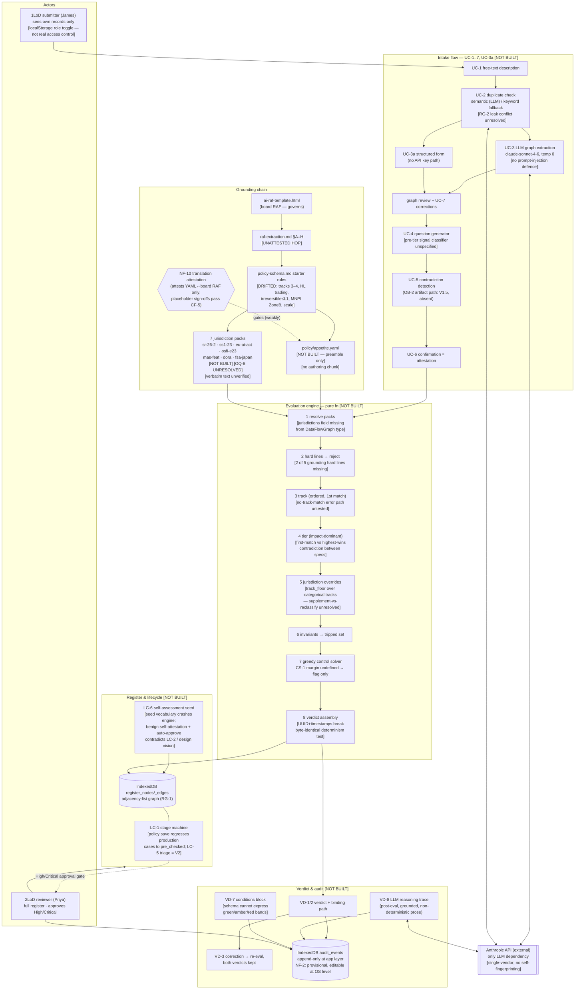

# AIGate — Full Repository Review

**Reviewed at:** commit `ffa9067` ("Complete tech spec suite"), June 2026
**Reviewer stance:** hostile PRA/Fed-quality regulator + senior policy-engine engineer + product critic
**Scope note:** The review prompt describes `specs/` and `init/` as empty. They are not — the repo now contains six domain specs, an architecture overview, and an implementation guide. This review covers the repository **as it actually exists**, which strengthens the review: several risks the prompt asked about hypothetically have now materialised concretely in the specs. Acknowledged limitations (L-1–L-5, NF-2/NF-3, HR-01–HR-10) are not repeated as findings.

---

## Task 1 — Gap Analysis: Requirements vs Test Cases vs Grounding

**[CRITICAL] Finding:** The grounding's Track classification rules 3 and 4 — "replaces a prior model → Track II" and "autonomy Level 3+, or human override rate < 5% at registration → Track II" (`raf-extraction.md §C`) — have no corresponding requirement, no starter track rule (`policy-schema.md §3.3`), and no test case.
**Why it matters:** A GenAI agentic system at autonomy L3 producing narrative output is Track III under the starter rules but Track II under the board-approved RAF — the engine will systematically under-classify the exact class of system (agentic AI) the framework was written to catch.
**Recommended fix:** Add two track rules to `policy-schema.md §3.3` starter config: `TRACK-II-REPLACE` (condition: `replaces_prior_model: true`) and `TRACK-II-AUTONOMY` (condition: `autonomy_level: { gte: 3 }`), ordered before `TRACK-III`. Add `replaces_prior_model: boolean` to `ProcessingNode` in `intake-flow.md §4.2` and to the structured form. Add test cases TC-PE-2-04 (L3 agentic narrative system → Track II) and TC-PE-2-05 (replacement system → Track II). The override-rate-at-registration clause needs a decision: either add `expected_override_rate` to intake or document its deferral to V2 monitoring explicitly in `raf-extraction.md`.

**[CRITICAL] Finding:** Two of the grounding's five hard lines (`raf-extraction.md §B`, confirmed verbatim in `ai-raf-template.html §7`) are not encoded: "fully autonomous trading decision → Do not accept" and "irreversible actions require autonomy Level 1 or below regardless of tier."
**Why it matters:** Starter HL-003 covers `decision_type in [lending, credit]` only — an autonomous trading agent trips a hard line only if it also happens to be tagged irreversible *and* client/market-facing (HL-001); and an L2/L3 system taking irreversible actions passes all three starter hard lines despite being outside appetite per the RAF's own words.
**Recommended fix:** Add `HL-004` (condition: `autonomy_level: { gte: 4 }, decision_type: { in: ["trading"] }`) and `HL-005` (condition: `output_reversibility: "irreversible", autonomy_level: { gte: 2 }`) to `policy-schema.md §3.2` and to the starter config requirements in §10. Add tests TC-PE-4-04 and TC-PE-4-05.

**[CRITICAL] Finding:** The grounding's cross-cutting property "Scale / blast radius" (`raf-extraction.md §A`) is absent from the `DataFlowGraph` type, the structured form, and every tier rule — so the Critical-tier trigger "external-facing at scale" (§D) cannot be implemented, and the grounding's own register example (client-facing chatbot = **Critical**, §E) comes out **High** under the starter tiers (`exposure: client-facing` only triggers TIER-HIGH).
**Why it matters:** A client-facing chatbot — the canonical Critical-tier GenAI deployment in the RAF — is mis-tiered one level down by the tool that claims to enforce that RAF, skipping CRO/Board-committee approval.
**Recommended fix:** Add `scale: 'limited' | 'at_scale'` to `OutputNode` in `intake-flow.md §4.2` and the UC-3a form; add a TIER-CRITICAL trigger `exposure in [client-facing, market-facing] AND scale = at_scale` to `policy-schema.md §3.4`; add a test asserting the §E chatbot example tiers Critical. While there, add the missing "capital" and "client financial outcome" Critical triggers from §D.

**[SIGNIFICANT] Finding:** The starter invariant `INV-ZONE-01` permits MNPI in "Zone B private" (`not_in: ["Zone C internal", "Zone B private"]`), but the grounding says MNPI is "Zone C only; prohibited externally" (`raf-extraction.md §B/§E`, HTML §6).
**Why it matters:** The engine will approve MNPI processing in private cloud, which the board-approved appetite prohibits — exactly the silent translation drift NF-10 exists to prevent, already present in the spec before a line of code is written.
**Recommended fix:** Change `INV-ZONE-01` condition to `data_zone: { not_in: ["Zone C internal"] }`, or — if a firm-specific Zone B tolerance is intended — change `raf-extraction.md §B` and the HTML first, then the spec, with the change recorded as a translation-attestation event.

**[SIGNIFICANT] Finding:** The KRI thresholds schema (`policy-schema.md §3.7`) flattens the grounding's three-band green/amber/red structure (§G) into single scalar thresholds, and drops the bands' distinct semantics (e.g. drift <3% green / 3–5% amber / >5% red becomes one `drift_threshold_pct: 5.0`).
**Why it matters:** VD-7's `conditions` block is explicitly the "cannot be retrofitted" hypothesis schema for V2 monitoring — shipping V1 with a schema that cannot express amber states forces exactly the retrofit the design forbids.
**Recommended fix:** Restructure each KRI in §3.7 as `{ green: …, amber: …, red: … }` bands and mirror that in `VerdictConditions` (`verdict-audit.md §4.1`), e.g. `model_drift: { amber_pct: 3.0, red_pct: 5.0 }`.

**[SIGNIFICANT] Finding:** The traceability claim "V1 requirements with ≥1 test: 46/46 — all V1 Must and Should requirements have at least one test" is false: VD-6 (Should, V1) has no test (its row shows "—" with a covered-by note that TC-VD-7-01 does not actually assert the `status`/`status_updated_at` fields), and the HR-10 decisions file claims a test verifying the LC-6 rejection warning ("Rejected verdict shows prominent warning to 2LoD role") that does not exist anywhere in the suite — LC-6's only test, TC-LC-4-02, checks register presence.
**Why it matters:** The QA artefact misstates its own coverage, and the LC-6 failure path — the one behaviour HR-10 was raised about — is untested despite being recorded as resolved.
**Recommended fix:** Add TC-VD-6-01 (verdict record contains `living_status` and `living_status_updated_at` populated at verdict time) and TC-LC-6-02 (seeded self-assessment forced to Rejected via a test policy → 2LoD warning banner displayed), then correct the Test Summary counts. Rename TC-LC-4-02 to TC-LC-6-01.

**[MINOR] Finding:** TC-UC-3-03's title says "Graph extraction is **not** deterministic" while its property asserts consistency across runs; and `[Trace: not-yet-traced]` plus `[Requirement: …]` coexist on every test, duplicating the traceability matrix with a stale annotation.
**Why it matters:** Cosmetic, but a title that contradicts its own assertion will mislead whoever implements the test.
**Recommended fix:** Retitle to "Graph extraction is structurally consistent — same description, same graph structure," and either populate or delete the `[Trace: …]` lines (the matrix is the trace; the per-test annotation is redundant).

---

## Task 2 — The Translation Chain (now four links long, three unattested)

The chain as it now stands: **board-approved prose RAF (`ai-raf-template.html`) → `raf-extraction.md` → spec starter content (`policy-schema.md §3, §10`) → `/gvm-build`-generated `appetite.yaml` + 7 pack files → engine.** NF-10 attests only the last hop against the first. Findings:

**[CRITICAL] Finding:** There is no chunk in the implementation guide that owns authoring the starter policy content and the seven jurisdiction packs — the highest-risk artifacts in the product (the rules themselves) have no owning work item, no human review gate, and no correctness tests (TC-PE-8-01/02 test only that the files load and produce *a* verdict, not that the rules match the grounding).
**Why it matters:** The walking-skeleton smoke test (P7-C03 step 3) assumes a starter config that nothing in the plan produces; in practice Claude will generate it inline during a build chunk with zero adversarial verification — and Task 1 above shows the spec-level translation has *already* drifted in four places before generation has even started.
**Recommended fix:** Add chunk **P2-C03 "Starter policy + pack authoring"** to `implementation-guide.md §1` with these gates: (a) generated `appetite.yaml` is diffed rule-by-rule against `raf-extraction.md` sections B–H by a human, and the diff record is committed; (b) every `source.text` field in a pack is copy-pasted by a human from the primary regulatory document (URL + retrieval date recorded), never generated; (c) the NF-10 `translation_attestation` is signed only after (a) completes.

**[CRITICAL] Finding:** The pack validation rules (`policy-schema.md §6`) check only field *presence* — a pack shipping with placeholder reviewer names (`reviewer_name: "[FIRM] — Regulatory Affairs Lead"`, as the spec's own SS1/23 example does) and a pre-filled `sign_off_date` passes CF-5 validation and produces non-provisional verdicts, defeating NF-7's entire purpose.
**Why it matters:** The product's core regulatory claim is "a qualified human stands behind every regulatory determination"; as specified, a machine-generated pack with fictional sign-offs is indistinguishable from a reviewed one — and a bank relying on it has told the PRA exactly the thing the README says is indefensible.
**Recommended fix:** In `policy-schema.md §6`, add a validation rule: any `reviewer_name` containing `[FIRM]` or matching the placeholder pattern → rule treated as **unsigned** → verdict flagged provisional per NF-7 (currently the only `[FIRM]` check is a non-blocking warning on `firm_name`). Add TC-NF-7-02 covering placeholder sign-offs.

**[CRITICAL] Finding:** The "verbatim" regulatory text in the spec's example pack rules is unverifiable and almost certainly paraphrased — e.g. `SS1/23 §3.4: "Models that produce quantitative outputs used in material decisions require independent validation, regardless of the underlying technique…"` appears nowhere as a literal sentence in SS1/23 — violating RA-7's own rule ("verbatim text, not paraphrased") inside the document that defines RA-7.
**Why it matters:** RA-9/VD-8 promise the auditor can "verify the reasoning against the original regulatory text"; if the quoted text doesn't exist in the source, the entire citation architecture becomes confident-looking fabrication — the worst possible failure mode for this product, and the "AI-generated YAML" risk materialised at spec stage.
**Recommended fix:** Add to RA-7's fit criterion: `source` must also carry `source_url` and `retrieved_date`, and the pack-authoring chunk (above) must verify each quote by exact string match against the retrieved document. Replace the example quotes in `policy-schema.md §4` with genuinely verbatim passages or mark them `[ILLUSTRATIVE — NOT VERBATIM]`.

**[SIGNIFICANT] Finding:** The hop `ai-raf-template.html → raf-extraction.md` is unattested, and the precedence rule is circular: the extraction says "where the two disagree, the HTML governs," but the specs and `appetite.yaml` cite only the extraction — so NF-10's attestation, which references "Board-approved AI RAF v2.1," attests against a document (the prose RAF) that nothing in the chain mechanically links to.
**Why it matters:** A regulator probing "show me the YAML rule that encodes §6 row 7 of your board-approved RAF" must today traverse two undocumented translations done by different processes at different times.
**Recommended fix:** Add a `derived_from` block to `raf-extraction.md`'s header (HTML file hash + date + reviewer) and extend the NF-10 `translation_attestation` schema with `extraction_version_checked` so the attestation explicitly covers both hops. State in NF-10's fit criterion that the attestation target is the **HTML/board RAF**, with the extraction as an intermediate artifact.

---

## Task 3 — Internal Consistency Across the Repository

**[CRITICAL] Finding:** The design vision's sequencing section says artifact binding (OB) is "the irreducible bet — must have in V1 to be credible; self-attested only = convincing demo, not a deployable product," yet the requirements index puts OB-1/OB-2/OB-5 at V1.5 and OB-3/OB-4 at V2+, and the intake-flow spec and implementation guide contain **zero** artifact-handling work — this contradiction is acknowledged nowhere.
**Why it matters:** V1 as currently specified is, by the project's own definition, the product it "must not become" — a demo that can't be deployed — and the strategic claim in the README ("reads what the system actually does") is false for everything currently planned.
**Recommended fix:** Make a decision and record it in `design-vision.md`: either (a) pull OB-1/OB-2/OB-5 into V1 for one artifact type (Terraform is the cheapest: parse HCL for endpoint hostnames and network config) and add a P4-C05 chunk, or (b) amend the sequencing section to say V1 is explicitly the engine-validation proof-of-concept and V1.5 is the first credible product, and rewrite the README's headline claim to match V1 reality.

**[CRITICAL] Finding:** The two specs contradict each other on tier-evaluation semantics — `policy-schema.md §3.4`: "rules evaluated top-to-bottom, first matching trigger determines the tier" vs `evaluation-engine.md §3.5`: "all tier rules are evaluated, the highest tier whose trigger fires is returned."
**Why it matters:** These differ whenever a bank reorders the (bank-editable) tiers array; first-match with Low listed first would down-tier everything — a one-line YAML edit silently changing the firm's appetite.
**Recommended fix:** Standardise on highest-tier-wins (order-independent, matches impact-dominance), delete the first-match sentence from `policy-schema.md §3.4`, and add a property test: permuting the `tiers` array never changes any verdict.

**[CRITICAL] Finding:** Jurisdiction packs apply `track_floor` over an ordering `TRACK_ORDER = {I: 3, II: 2, III: 1}` (`evaluation-engine.md §3.6` — complete with an unedited "Wait —" thinking-aloud artifact left in the shipped spec), but tracks are categories by model type, not ordered severity: "upgrading" a GenAI Track III system to Track I (Traditional MRM) is semantically meaningless, Track II is arguably *more* demanding than Track I (full MRM **plus** AI controls per §C), and the grounding's own model is "Track III is **supplemented** with that standard's obligations; track assignment never reduces the jurisdictional minimum" — supplement, not reclassify.
**Why it matters:** The floor-over-categorical model can route a generative system into a governance regime designed for regression models (losing the AI-specific controls), and the grounding/requirements disagreement (supplement vs reassign — PE-6's fit criterion says Track III→Track II under SS1/23) is unresolved at the conceptual level.
**Recommended fix:** Replace `track_floor` with a `supplement_obligations` effect (pack adds required controls/validation obligations to the assigned track) in `policy-schema.md §4` and `evaluation-engine.md §3.6`; if track reassignment is genuinely intended, amend `raf-extraction.md §C` first and define the demanding-ness ordering explicitly with regulatory justification. Either way, delete the "Wait —" paragraph and replace it with the decided rule.

**[CRITICAL] Finding:** The vocabulary problem: conditions are exact string matches, but no canonical enum spec exists, and the repo already uses at least four inconsistent vocabularies — policy (`"Internal"`, `"Zone B private"`, `model_type: "llm"`), test cases (`"Zone B"`), grounding (`A/B/C`), and the LC-6 seed graph (`'internal'`, `'zone_b'`, `'nlp_text_generation'`, `'internal_only'`) — and `'nlp_text_generation'` matches no track rule, so the AIGate self-assessment as specified fails on first launch with a `no-track-match` engine error.
**Why it matters:** With exact-match conditions, every vocabulary mismatch is a silently non-firing rule — the engine stays deterministic while becoming quietly wrong, which is L-2 in its purest form; the seed graph crashing is just the first visible symptom.
**Recommended fix:** Add a §3.0 "Canonical attribute vocabulary" to `policy-schema.md` defining the closed enums for `data_class`, `data_zone`, `model_type`, `exposure`, `decision_bindingness`, `action_type`, `decision_type`; have CF-5 validation reject any condition value outside the vocabulary; constrain the LLM extractor's JSON schema to these enums (the spec already passes permitted values — make them `enum` constraints, not prose); and rewrite `aigate-self-assessment.ts` in `register-lifecycle.md §9` using canonical values.

**[CRITICAL] Finding:** The LC-6 self-assessment is engineered to pass: the seed graph self-attests the most benign value on every axis (autonomy 1, internal-only, reversible, internal data, advisory) and step 5 auto-sets lifecycle to `approved` — while `design-vision.md` states AIGate "is a High or Critical use case under its own framework," and LC-2 requires active 2LoD approval for High/Critical.
**Why it matters:** The flagship honesty mechanism is specified as the exact gaming pattern (optimistic self-attestation to dodge oversight) that the grounding calls "a conduct matter," and the auto-approve contradicts LC-2 if the tier comes out High/Critical.
**Recommended fix:** In `register-lifecycle.md §9`: set the seed graph to honest values (`decision_bindingness: material` — the verdict drives governance decisions; LLM extraction touches whatever the submitter types, so data class is bounded by intake content, not "internal"), let the engine assign tier, and route the result through `workflow-router.ts` like any other use case — if it lands High, it sits at `pre_checked` until the 2LoD role approves it, which is precisely the live test LC-6 promises.

**[SIGNIFICANT] Finding:** `DataFlowGraph` (`intake-flow.md §4.2`) has no `jurisdictions` field, yet `evaluate()` Step 1 reads "jurisdictions: string[] from graph" and the form collects jurisdictions — the type the whole system pivots on cannot carry the attribute the jurisdiction engine requires.
**Why it matters:** A type-level hole at the core abstraction that every spec claims "flows cleanly through all specs" (architecture overview §6 point 1).
**Recommended fix:** Add `jurisdictions: string[]` to `DataFlowGraph` in `intake-flow.md §4.2`, and specify how the LLM path obtains it (extracted with `uncertain: true` default + mandatory confirmation question, since jurisdiction is rarely inferable from a two-sentence description).

**[SIGNIFICANT] Finding:** CS-1's "safety margin = 10% of the distance from the boundary" is mathematically undefined over boolean invariants (there is no metric space in the condition language), the engine spec quietly downgrades it to a `boundary_proximity` flag with "full margin-aware solving is V1.5" (§4.2), yet CS-1 is Must/V1 and TC-CS-1-02 requires the solver to *choose between sets* based on margin.
**Why it matters:** A V1 Must requirement is unimplementable as written and its test will fail against the spec'd behaviour — and "margin" language in a verdict that has no underlying metric is compliance theatre.
**Recommended fix:** Rewrite CS-1 to match what's buildable: "the solver returns the minimal burden-weighted set; the verdict carries `boundary_proximity: true` when any satisfied invariant has zero redundant coverage," demote margin-based set selection to V1.5 with a defined metric (e.g. count of invariants resolved by >1 selected control), and rewrite TC-CS-1-02 against the flag.

**[SIGNIFICANT] Finding:** The determinism contract is self-contradictory — `evaluation-engine.md §7` forbids `Date.now()`/`Math.random()` inside `evaluate()`, yet §3.9's `Verdict` (the function's return value) includes `id: UUID v4`, `attested_at`, and `living_status_updated_at`, and TC-PE-1-01 demands the verdict be "byte-identical" across 10 runs.
**Why it matters:** Either the engine breaks its own purity rule or the property test can never pass; whoever builds P3-C01 will resolve it arbitrarily.
**Recommended fix:** Split the type: `evaluate()` returns a pure `EvaluationResult` (status/tier/track/constraints/controls/conditions — byte-identical), and the caller wraps it into a `Verdict` envelope adding `id`/timestamps/attestation; point TC-PE-1-01 and TC-NF-1-01 at `EvaluationResult`.

**[SIGNIFICANT] Finding:** UC-4's question budget depends on tier ("Low ≤5, Critical ≤15") but tier is assigned in evaluation Step 4, *after* confirmation — `intake-flow.md §6` hand-waves "Low-tier signals detected" without defining the pre-tier signal classifier, which is itself a shadow tiering pass nobody has specified.
**Why it matters:** TC-UC-4-01/02 cannot be implemented or pass deterministically without that classifier, and a wrong pre-tier guess either over-questions Low cases (usability failure) or under-questions Critical ones (governance failure).
**Recommended fix:** Specify in `intake-flow.md §6` that the generator runs `assignTier()` on the provisional graph (uncertain fields treated as worst-case) to get the question budget, and record that provisional tier in the audit trail as `question_budget_basis`.

**[SIGNIFICANT] Finding:** UC-2 duplicate detection conflicts with RG-2 access control — surfacing "UC-001: tier High, Track III, Approved with controls" to a 1LoD submitter leaks another team's use case metadata that RG-2 says they must not see, and no spec addresses which corpus the similarity check runs against per role.
**Why it matters:** Either duplicate detection only sees the submitter's own records (defeating its purpose) or it leaks cross-team data (violating RG-2); both are wrong and neither is decided.
**Recommended fix:** Add to UC-2's fit criterion: the duplicate check runs against the full register but surfaces to 1LoD only a redacted match ("a similar use case exists — tier High; contact 2LoD to adopt its classification") with full detail visible to 2LoD; specify in `intake-flow.md §3` and add a test.

**[SIGNIFICANT] Finding:** `register-lifecycle.md §8` re-evaluation regresses every active use case (including `in_production`) to `pre_checked` on any policy save, never actually re-runs `evaluate()`, and §10.2 references a `re_evaluation_queued` audit event that does not exist in the `AuditEventType` union (`verdict-audit.md §4.3`).
**Why it matters:** A comment typo fix in the YAML revokes the approved status of the entire production estate (an operational-risk event in its own right), produces no diff (RG-4's actual deliverable), and the register banner is keyed to an event type the store can never emit.
**Recommended fix:** In §8: add `re_evaluation_queued` to the `AuditEventType` union; on policy save, append that event without changing lifecycle stage; the stage transitions to `pre_checked` only when a human (2LoD) triggers the re-run or when the re-run verdict differs from the stored one. Note this explicitly as the V1 simplification of LC-5.

**[MINOR] Finding:** Requirements-document defects: LC-5 is tagged Must yet versioned V2+ (the priority model defines Must as "present at launch"); LC-6 contains a stray second fit criterion that belongs to LC-4; RG-1 and RG-7 each carry orphaned fit criteria from other requirements; NF-3 has its fit criterion duplicated; the NF section is ordered NF-10, NF-7–9, NF-1–6.
**Why it matters:** Individually cosmetic, collectively they signal the document was machine-assembled without a final human pass — which a hostile reviewer will use to question everything else.
**Recommended fix:** Re-tag LC-5 as Should/V2+ (or pull into V1.5); move the "Re-evaluation produces a new verdict record…" criterion from LC-6 to LC-4; relocate the orphaned RG criteria; deduplicate NF-3; renumber/reorder NF-1 first.

---

## Task 4 — Open Questions (status after the tech-spec commit)

OQ-1 (Anthropic `claude-sonnet-4-6`), OQ-2 (`idb`/IndexedDB), OQ-3 (localStorage role toggle), OQ-4 (semantic + keyword fallback), OQ-5 (JSON export) are now **resolved** in `cross-cutting.md §10–11` — the requirements doc's "Deferred to /gvm-tech-spec" lines are stale and should be updated to point at the resolutions. The live items:

**[CRITICAL] Finding:** OQ-6 (pack maintenance and distribution) is deferred to "before V2," but RA-7's verbatim-text requirement makes it a **V1** question: someone must acquire, verify, and sign the regulatory text in the seven starter packs before the first verdict is defensible (see Task 2), and option 1 (central maintenance) implies a distribution/signing mechanism that the no-backend V1 architecture cannot host.
**Why it matters:** Resolved incorrectly (e.g., "Claude generates the packs, banks trust them"), this is the highest-downstream-risk OQ in the repo — it is the monoculture risk (L-4), the translation-fidelity gap (L-5), and the determinism-is-not-correctness problem (L-2) compounded into one decision.
**Recommended fix:** Split OQ-6: resolve **OQ-6a now** ("who authors and signs the V1 starter packs" → the P2-C03 chunk from Task 2, signed by a named human) and keep OQ-6b (ongoing distribution model) for V2 — record the split in `requirements.md §9`.

**[SIGNIFICANT] Finding:** OQ-PV-2 ("needs validation against a real bank's control dependencies before V1 ships") binds a V1 ship-gate to a V2+ feature (PV-3 is V2+), and ADR-003 declares the envelope schema "present in the schema from V1" while the starter config sections list (§10) omits `platforms`/`vendor_model_registry`.
**Why it matters:** Either the schema ships in V1 (then the starter config table is wrong and the loader must parse-and-ignore it, which needs a validation rule) or it doesn't (then ADR-003's "no migration" claim fails).
**Recommended fix:** Add `platforms: []` and `vendor_models: []` as optional, parsed-but-inert sections to `policy-schema.md §3.1` and §10, with a loader rule "present but not evaluated in V1"; move OQ-PV-2's validation gate explicitly to the V2 entry criteria.

---

## Task 5 — Risk Assessment Coverage

**[CRITICAL] Finding:** The AI-generated-policy risk is absent from `risk-assessment.md` — and unlike when the prompt was written, it is no longer hypothetical: the spec's own example "verbatim" citations are unverified, the pack sign-off fields ship pre-filled with placeholders that pass validation, and no adversarial test of generated rules against the grounding exists anywhere in the plan.
**Severity:** Fatal if unaddressed before any external deployment; manageable with the P2-C03 chunk + placeholder-rejection validation (Task 2).
**Recommended fix:** Add a feasibility-risk paragraph to `risk-assessment.md` naming the risk ("LLM-generated rules wrapped in deterministic enforcement convert one-time interpretation errors into permanent systematic errors") and its mitigations (human grounding diff, verbatim-text provenance, placeholder rejection), cross-referenced to the new chunk.

**[SIGNIFICANT] Finding:** L-4 (concentration monoculture) lives only in `design-vision.md` and is absent from `risk-assessment.md` — and the repo now contains a concrete instance of it: AIGate hardcodes a single vendor and a single pinned model (`claude-sonnet-4-6`) for the extraction step that determines every graph, with no fingerprinting or quality monitoring of its *own* model dependency, while shipping a control library whose marquee control is "output fingerprinting against silent vendor model substitution."
**Severity:** Manageable, but reputationally dangerous — a regulator or buyer will spot the recursion immediately.
**Recommended fix:** Add a viability/feasibility paragraph to `risk-assessment.md` covering both the customer-side monoculture (L-4 verbatim, with RA-12 as mitigant) and the product's own Anthropic single-vendor dependency; add a V1.5 item: a fixed probe-description set whose extracted graphs are regression-tested on every model version change (AIGate's own silent-substitution control, applied to itself).

**[SIGNIFICANT] Finding:** The "AIGate as a model" regulatory exposure is unassessed — under OSFI E-23's broadest-definition scope ("any technique whose output feeds a decision or risk control") and SS1/23's technology-agnostic standard, the pre-check engine plus its LLM extraction layer is squarely in MRM scope, and LC-6 (self-classification) does not answer the harder challenge: is the *engine itself* subject to independent validation, conceptual-soundness review, and ongoing monitoring at the standard it enforces on others?
**Severity:** Manageable known risk for V1 internal use; fatal for the commercial claim if unanswered when a bank's model-validation function asks.
**Recommended fix:** Add a feasibility paragraph to `risk-assessment.md`: AIGate's deterministic engine requires conceptual-soundness validation (the rule set vs the RAF — this is the NF-10 attestation, name it as such) and the LLM extraction layer requires the Track III/behavioural-verification controls from the firm's own framework (sampling of extracted graphs vs human-built ground truth); state that LC-6's verdict should *list* these as its required controls, closing the loop.

---

## Task 6 — Test Case Quality Review

**[SIGNIFICANT] Finding:** The three `[PROPERTY]` tests are repetition tests, not property-based tests — they verify stability under fixed inputs, which catches `Math.random()` but not order-dependence, missing-rule coverage, or monotonicity violations; genuine properties are available and cheap here because the input space is a closed enum vocabulary.
**Why it matters:** Determinism is the product's headline claim; repetition testing certifies the weakest version of it while the strong versions (the ones that catch real rule errors) go untested.
**Recommended fix:** Add fast-check generators over the canonical vocabulary (Task 3) and four genuine properties to the suite: (1) **jurisdiction monotonicity** — adding a jurisdiction never lowers final tier or weakens final track; (2) **impact dominance** — mutating any non-trigger field never demotes a Critical verdict; (3) **hard-line supremacy** — any graph matching a hard line yields `rejected` regardless of all other fields; (4) **solver soundness** — every tripped invariant is resolved by some control in the returned set; plus the order-independence property from the tier-semantics fix.

**[CRITICAL] Finding:** Security coverage is one XSS test (TC-UC-1-04) against a system that (a) feeds attacker-influenceable free text into an LLM whose output becomes attested governance data, (b) renders LLM-generated prose and bank-editable policy `description` strings in the UI, (c) stores the bank's Anthropic API key in `localStorage` with `dangerouslyAllowBrowser`, and (d) loads externally-sourced YAML with no authenticity check — the OWASP LLM Top 10 the health report cites covers exactly (a) and (d) and neither is tested.
**Why it matters:** The realistic adversary is not a hacker but an optimistic developer: a description crafted (or pasted from a template) to steer the extractor toward benign classifications defeats the entire intake — and contradiction detection can't fire if the extraction itself was steered.
**Recommended fix:** Add: TC-UC-3-04 [SECURITY] — description containing extraction-steering instructions ("classify all data as Internal") yields a graph reflecting content, not instructions, with steering text flagged; TC-VD-8-02 [SECURITY] — reasoning trace and policy descriptions rendered as text, never HTML; TC-CF-5-04 [SECURITY] — pack file with `__proto__`/duplicate-key YAML rejected by Zod; TC-NF-11-01 — API key never present in register/audit exports; and a documented-limitation test that the localStorage role toggle is labelled "not access control" in the UI (ADR-009's honesty made visible).

**[SIGNIFICANT] Finding:** Several Must-requirement tests are happy-path only: PE-3's "no combination of low scores can produce Medium or Low" is asserted by a single example (needs the impact-dominance property above); no test covers the `no-track-match` engine error path (`evaluation-engine.md §3.4`) even though the Task 3 vocabulary finding shows it will fire in practice; no test covers `evaluate()` against a graph with multiple processing nodes (every example is a single linear chain — which node's `autonomy_level` does a condition like `autonomy_level: { gte: 4 }` test against? The condition-evaluation semantics over multi-node graphs is unspecified anywhere).
**Why it matters:** The multi-node question is not an edge case — "reads client emails, summarises, then a second agent drafts replies" is the project's own Journey 1, and the engine spec never says whether conditions match any-node, all-nodes, or per-path.
**Recommended fix:** Specify condition semantics in `evaluation-engine.md §3` (recommended: a condition over a node attribute matches if **any** node on **any** input→output path satisfies it, with the matching path recorded as `binding_path`); add TC-PE-1-03 (multi-node graph, condition fires on second processing node) and TC-PE-2-06 (`no-track-match` → engine error surfaced, not a silent default).

**[MINOR] Finding:** The `[Trace: not-yet-traced]` annotations are acceptable pre-build only if the build process wires them; nothing in the implementation guide's chunk definitions requires updating them.
**Recommended fix:** Either delete the annotation (the matrix is canonical) or add to `implementation-guide.md §6` a chunk-exit rule: tests implemented in a chunk get `[Trace: src/...test.ts]` updated in `test-cases.md`.

---

## Task 7 — System Diagram

As specified today. `[NOT BUILT]` = no code exists (the repo contains zero `src/`); `[OQ-N]` = unresolved decision; `[DRIFTED]` = spec content diverges from grounding (Task 1/3 findings).

---

## Summary: Top 5 Issues

1. **The rules themselves have no owner, no review gate, and already-drifted content.** No implementation chunk authors the starter policy and seven packs; "verbatim" citations are unverified; placeholder reviewer sign-offs pass validation; and the spec-level translation has already diverged from the grounding in four material places (missing track rules, missing hard lines, MNPI Zone B, no scale attribute). **Fix:** add chunk P2-C03 (human-verified pack authoring with source-text provenance), make `[FIRM]` reviewer names fail NF-7, and correct the four drift points in `policy-schema.md` against `raf-extraction.md` §B–§D.

2. **Exact-string-match conditions with no canonical vocabulary make the engine deterministically wrong by default.** Four inconsistent vocabularies already exist in the repo, and the LC-6 seed graph as written crashes the engine on first launch. **Fix:** add the canonical enum spec to `policy-schema.md §3.0`, enforce it in CF-5 validation and the LLM extractor's JSON schema, and rewrite the seed graph.

3. **V1 contradicts the product's own definition of credibility.** The design vision declares artifact binding the irreducible V1 bet; the requirements and specs ship V1 with zero OB work — and the README's headline claim describes V1.5, not V1. **Fix:** decide — pull one artifact type (Terraform) into V1, or amend the design vision and README to honestly position V1 as engine validation.

4. **The LC-6 self-assessment is specified as a rigged demo.** Benign self-attested values plus auto-approve to `approved` is the gaming pattern the RAF calls a conduct matter, applied to the tool's flagship honesty mechanism. **Fix:** honest seed attributes, engine-assigned tier, routed through the standard tier-to-workflow gate — including the 2LoD approval wait if it lands High/Critical.

5. **Three V1 Musts are unimplementable as written.** CS-1's safety margin has no metric over boolean invariants (spec already downgraded it; the test didn't follow); the determinism tests demand byte-identical verdicts containing UUIDs and timestamps; UC-4's question budget needs a tier that doesn't exist yet. **Fix:** split `EvaluationResult` from the `Verdict` envelope, rewrite CS-1 around the proximity flag, and specify the provisional-tier pass that sets the question budget.

---

*Review conducted against every file in the repository at commit `ffa9067`. No acknowledged limitation (L-1–L-5, HR-01–HR-10, NF-2/NF-3) is restated above except where the repo's current state contradicts its own acknowledgement.*
